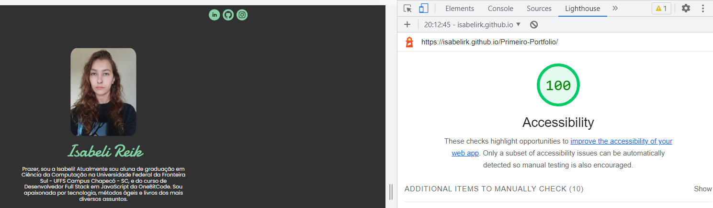

# Primeiro Portfólio

Este projeto se refere à construção de um site pessoal (portfólio) desenvolvido para a conclusão do curso de HTML5 e CSS3 no Potência Feminina. Além de ter colocado em prática os conteúdos vistos, também pude aplicar a metodologia internacional BEM de nomenclatura de classes para CSS. Para mais informações sobre o BEM [clique aqui](https://desenvolvimentoparaweb.com/css/bem/).

Ainda neste projeto, trabalhei com a personalização de arquivos SVG. Para mais informações sobre as possibilidades do SVG [clique aqui](https://developer.mozilla.org/pt-BR/docs/Glossary/SVG). E para melhorar o meu arquivo CSS, apliquei os meus conhecimentos sobre propriedades personalizadas (ou variáveis) na estilização da cor de alguns textos em específico. Para mais informações sobre as propriedades personalizadas do CSS [clique aqui](https://developer.mozilla.org/pt-BR/docs/Web/CSS/Using_CSS_custom_properties).

OBS: foi realizado alguns pequenos ajustes para que o site ficasse mais acessível, e realizando o teste da aba "Lighthouse" no Google Chrome, podemos observar que o mesmo está 100%:

## Sobre

Este site pessoal está divido da seguinte forma:

- Um header no qual possui os meus perfis no LinkedIn, GitHub e Instagram.

- Uma main, onde coloquei uma foto minha, meu nome e um pequeno texto sobre mim em uma div.

- Logo após, ainda na main, uma section onde é listado alguns certificados de cursos que já concluí.

- E por último, um footer com os créditos da criação do site e uma animação de um coração pulsando.

## Ferramentas utilizadas

- HTML5
- CSS3
- VSCode
- GitHub Pages
