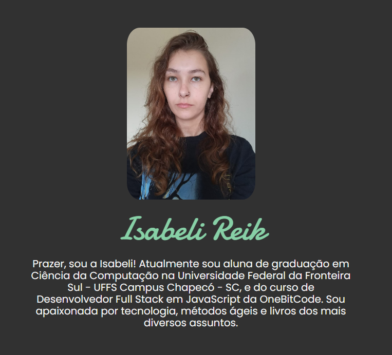

# Primeiro Portfólio

Este projeto se refere à construção de um site pessoal (portfólio) desenvolvido para a conclusão do curso de HTML5 e CSS3 no Potência Feminina. Além de ter colocado em prática o conteúdo sobre HTML5 e CSS3 vistos, também pude aplicar a metodologia BEM de nomenclatura de classes. Para mais informações sobre o BEM [clique aqui](https://desenvolvimentoparaweb.com/css/bem/).

## Sobre

Este site pessoal está divido da seguinte forma:

-> Um header no qual possui os meus perfis no LinkedIn, GitHub e Instagram.

-> Uma main, onde coloquei uma foto minha, meu nome e um pequeno texto sobre mim em uma div.

-> Logo após, ainda na main, uma section onde é listado alguns certificados de cursos que já conclui.

-> E por último, um footer com os créditos da criação do site.

